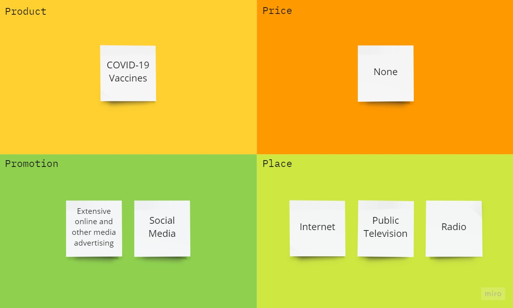
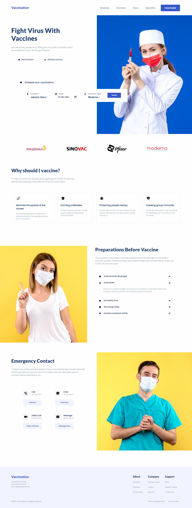

<!-- PROJECT LOGO -->
 

  

<h3 align="center">Launch X - Front-end CSS</h3>

  

    Assignment from the third week of Launch X's frontend introduction course
     
    <a href="https://github.com/javiermendez-coder/LaunchX-FrontEnd-02-css"><strong>Explore the docs »</strong></a>
     
     
    <a href="https://github.com/javiermendez-coder/LaunchX-FrontEnd-02-css/issues">Report Bug</a>
    ·
    <a href="https://github.com/javiermendez-coder/LaunchX-FrontEnd-02-css/issues">Request Feature</a>
  

<!-- TABLE OF CONTENTS -->

  
Table of Contents

  <ol>
    <li>
      <a href="#about-the-project">About The Project</a>
      <ul>
        <li><a href="#marketing-plan">Marketing Plan</a></li>
        <li><a href="#website-screenshot">Website Screenshot</a></li>
        <li><a href="#built-with">Built With</a></li>
      </ul>
    </li>
    <li><a href="#contact">Contact</a></li>
  </ol>

<!-- ABOUT THE PROJECT -->
## About The Project

The project's target stands on cloning a [web page][web-page] (made by [Adhiari Subekti][author]) using the knowledge gathered throughout multiple sessions. Besides a marketing plan is required.

(<a href="#top">back to top</a>)

### Marketing Plan

(<a href="#top">back to top</a>)

### Website Screenshot

(<a href="#top">back to top</a>)

### Built With

* HTML
* CSS

(<a href="#top">back to top</a>)

<!-- CONTACT -->
## Contact

Javier Méndez - javiermendez0299@gmail.com

Project Link: [https://github.com/javiermendez-coder/LaunchX-FrontEnd-02-css](https://github.com/javiermendez-coder/LaunchX-FrontEnd-02-css)

(<a href="#top">back to top</a>)

<!-- MARKDOWN LINKS & IMAGES -->
[web-page]: https://github.com/LaunchX-InnovaccionVirtual/FrontEnd-Mision/blob/main/03%20-%20CSS/practica/landingVacunaci%C3%B3n.png
[author]: https://dribbble.com/Adhiari_is